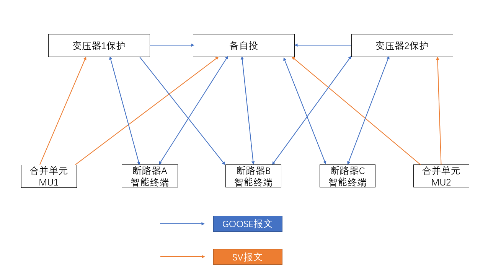
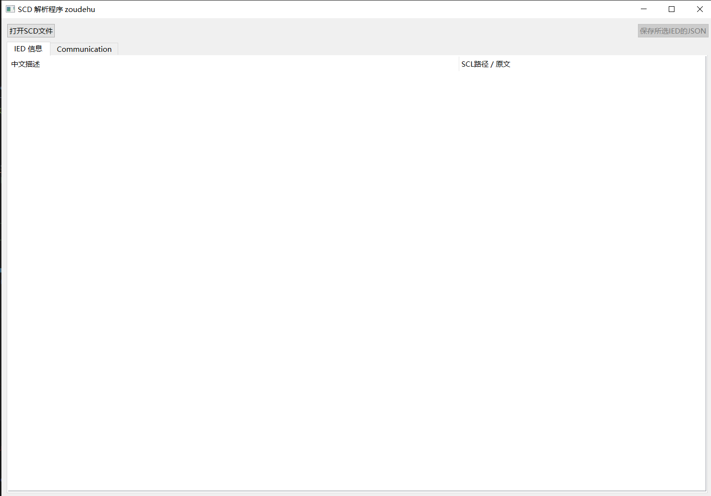
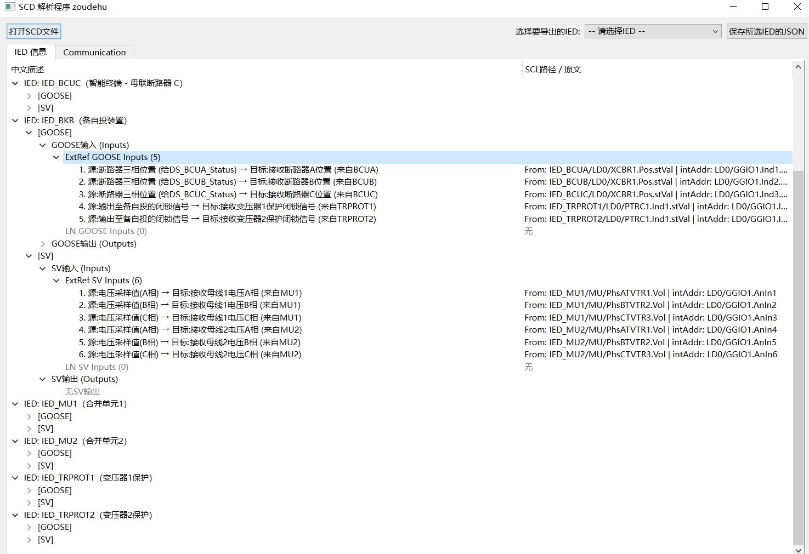

# SCD 开源解析工具 pySCD

## 作者：Zou Dehu

## 1. 工具简介与目的

本工具旨在帮助电气工程师更方便地查看和理解IEC 61850标准中的SCL（系统配置描述）文件（通常是`.scd`格式）。SCD文件包含了变电站自动化系统中所有设备（IED）、通信设置、数据流（GOOSE和SV）等的详细信息。

在进行IEC 61850系统调试、配置核对或故障排查时，直接阅读XML格式的SCD文件可能非常困难。本工具通过图形界面（GUI）将SCD文件中的关键信息进行解析和整理，特别是GOOSE和SV的输入输出关系，使其更加直观易懂。

**主要用途：**

*   快速浏览SCD文件中定义的IED及其基本信息。
*   清晰地查看每个IED接收（输入）和发送（输出）的GOOSE报文和SV采样值数据。
*   理解数据点（FCDA）的含义（如果SCD文件中配置了描述信息）。
*   查看IED之间的通信链接关系（基于ExtRef）。
*   查看网络通信参数（IP地址、MAC地址、VLAN、APPID等）。
*   **导出指定IED的详细信息为JSON格式文件**，便于离线分析、存档或与其他工具集成。

## 2. 主要功能

*   **加载SCD文件：** 支持打开标准的`.scd`文件（以及`.icd`, `.cid`等SCL文件）。
*   **IED信息展示：**
    *   在“IED 信息”选项卡中，以树状结构列出所有IED。
    *   展示每个IED的GOOSE和SV的输入与输出信息。
    *   **输入信息：**
        *   区分通过`Inputs`部分`<ExtRef>`明确定义的外部引用。
        *   区分通过逻辑节点（LN）建模的输入点（如GOOSE的`GGIO`，SV的`GGIO`）。
        *   尝试解析并显示`ExtRef`的源信号描述和目标信号描述。
        *   对解析或查找描述失败的条目进行高亮提示（红色或洋红色）。
    *   **输出信息：**
        *   列出GSEControl（GOOSE控制块）和SampledValueControl（SV控制块）。
        *   展示每个控制块关联的数据集（DataSet）及其包含的功能约束数据属性（FCDA）。
        *   尝试显示每个FCDA的描述信息（信号含义）。
*   **通信信息展示：**
    *   在“Communication”选项卡中，显示子网（SubNetwork）信息。
    *   列出每个子网下的接入点（ConnectedAP），包括IED名称、IP地址、MAC地址、VLAN ID等。
    *   显示为该IED配置的GOOSE和SV报文的网络参数（如MAC地址、APPID、VLAN ID）。
*   **单IED信息导出：**
    *   允许用户从下拉列表中**选择一个特定的IED**。
    *   将所选IED的所有解析信息（包括GOOSE/SV输入输出详情）**导出为单个JSON文件**。

以下的例子采用项目里面的bzt.scd，这是作者设计的简化的、开源SCD文件。结构如下图：



## 3. 环境准备与安装

要运行此工具，你的电脑需要：

1.  **安装Python：** 建议安装Python 3.7或更高版本。你可以从Python官网 ([https://www.python.org/downloads/](https://www.python.org/downloads/)) 下载安装包。安装时，请确保勾选“Add Python to PATH”选项。
2.  **安装依赖库 (PySide6)：** Python安装完成后，打开电脑的命令提示符（CMD）或终端，输入以下命令并按回车：
    ```bash
    pip install PySide6
    ```
    等待安装完成。
3.  **获取工具脚本：** 将包含此工具代码的Python脚本文件下载或复制到你的电脑上。

## 4. 如何使用

1.  **运行工具：**
    *   打开命令提示符（CMD）或终端。
    *   使用`cd`命令切换到你存放工具脚本的目录。例如：`cd C:\MyTools`。
    *   输入以下命令并按回车来启动程序：
        ```bash
        python main.py
        ```
    *   稍等片刻，程序的主窗口将显示出来。如下图：



1.  **加载SCD文件：**
    *   点击窗口左上角的 **“打开SCD文件”** 按钮。
    *   在弹出的文件选择对话框中，找到并选择你要分析的SCD文件，然后点击“打开”。
    *   程序将开始加载和解析文件。这可能需要一些时间，特别是对于大型SCD文件。期间界面可能会显示“正在加载和解析...”。
    *   解析完成后，界面上的两个选项卡（“IED 信息”和“Communication”）将被填充内容，并会弹出一个提示框告知解析完成。

2.  **浏览信息：**
   

    *   **IED 信息选项卡：**
        *   左侧是树状列表，顶层是文件中的所有IED。点击IED名称前的 `>` 符号可以展开查看其详细信息。
        *   展开IED后，会看到 `[GOOSE]` 和 `[SV]` 两个主要分支。
        *   在 `[GOOSE]` 或 `[SV]` 下，有 `输入 (Inputs)` 和 `输出 (Outputs)` 分支。
        *   **输入 (Inputs)：**
            *   `ExtRef ... Inputs`：显示通过 `<ExtRef>` 定义的输入信号。每一项通常格式为：“序号. 源: [源信号描述] → 目标: [目标信号描述]”。右侧列显示了SCL中的详细路径（`From: IED/LD/LN.DO.DA | intAddr: ...`）。
                *   **颜色提示：** 如果目标描述部分显示为 **红色**，通常表示工具在当前IED中查找目标点描述时遇到问题（如 `intAddr` 格式错误、找不到对应的DOI等）。如果源描述部分显示为 **洋红色**，表示查找源IED中的信号描述时遇到问题。这有助于定位SCD文件配置可能存在的问题。
            *   `LN ... Inputs`：显示通过特定逻辑节点（如 `LN Class="GGIO"`）建模的输入。通常会列出LN的描述和其下的DOI（数据对象实例）列表及其描述。
        *   **输出 (Outputs)：**
            *   列出GOOSE控制块（GSE）或SV控制块（SMV）的名称、AppID/SmvID以及关联的数据集（DataSet）名称。
            *   展开后，可以看到 `FCDA Members`，即该输出报文包含的数据点列表。每一项通常格式为：“序号. [信号描述]”，右侧列显示该信号在SCL中的路径。
    *   **Communication 选项卡：**
        *   顶层是子网（SubNetwork）信息，包括名称、类型和速率。
        *   展开子网，可以看到 `ConnectedAPs`（连接的接入点）。
        *   展开 `ConnectedAPs`，列出接入该子网的IED及其接入点（AP）名称。
        *   展开具体的IED/AP，可以看到：
            *   `Address`：该IED/AP的IP地址、MAC地址、VLAN等网络参数。
            *   `GSE Configured` / `SMV Configured`：为该IED配置的GOOSE/SV发送参数，包括控制块名称、LD实例、以及具体的网络地址信息（如目标MAC、APPID、VLAN ID等）。

3.  **导出单个IED的JSON文件：**
    *   在SCD文件成功加载后，窗口顶部的 **“选择要导出的IED:”** 标签和其右侧的下拉列表框会变为可用。
    *   点击下拉列表框，从列表中选择你想要导出信息的那个IED的名称。
    *   选择IED后，点击旁边的 **“保存所选IED的JSON”** 按钮。
    *   在弹出的保存文件对话框中，选择你想要保存文件的位置，确认或修改文件名（默认为 `[IED名称]_parsed.json`），然后点击“保存”。
    *   程序会将你选择的那个IED的所有解析信息（与在“IED 信息”选项卡中看到的内容对应）保存到一个JSON文件中。
    *   完成后会弹出成功提示。

## 5. 理解导出的JSON文件

当你导出单个IED的JSON文件时，其内容是结构化的文本数据，主要包含以下部分：

*   **`name`**: 你导出的IED的名称。
*   **`desc`**: 该IED的描述信息。
*   **`GOOSE`**: 关于GOOSE通信的部分。
    *   **`inputs`**: GOOSE输入信息。
        *   **`ExtRef`**: 一个列表，包含所有通过 `<ExtRef>` 定义的GOOSE输入。每个条目包含：
            *   `iedName`: 源IED名称。
            *   `ldInst`, `prefix`, `lnClass`, `lnInst`, `doName`, `daName`: 源信号的SCL路径信息。
            *   `intAddr`: 目标IED内部地址（指向本IED的哪个点）。
            *   `source_desc`: 解析得到的源信号描述。
            *   `dest_desc`: 解析得到的目标信号描述。
        *   **`LN`**: 一个列表，包含所有通过逻辑节点建模的GOOSE输入。每个条目包含：
            *   `ln_desc`: 该逻辑节点的描述。
            *   `dois`: 一个列表，包含该LN下的数据对象实例（DOI），每个DOI有 `name` 和 `desc`。
    *   **`outputs`**: GOOSE输出信息。一个列表，包含所有GSEControl（GOOSE控制块）。每个条目包含：
        *   `name`: 控制块名称。
        *   `appID`: GOOSE的应用ID。
        *   `dataSet`: 关联的数据集名称。
        *   `fcda`: 一个列表，包含数据集中的所有FCDA（数据点）。每个FCDA条目包含：
            *   `desc`: 解析得到的信号描述。
            *   `ldInst`, `prefix`, `lnClass`, `lnInst`, `doName`, `daName`: 该数据点在本IED中的SCL路径信息。
            *   `path_info`: 组合后的SCL路径字符串。
*   **`SV`**: 关于采样值（SV）通信的部分，结构与`GOOSE`类似，包含`inputs` (`ExtRef`, `LN`) 和 `outputs`。
    *   在`outputs`部分，每个条目代表一个SampledValueControl（SV控制块），包含 `name`, `smvID`, `dataSet` 等。
    *   SV的`fcda`列表可能还会区分 `grouped` (按LN分组显示) 和 `individual` (独立显示)。

这个JSON文件可以用文本编辑器打开查看，或者被其他脚本、工具（如Excel的JSON导入功能）进一步处理。它提供了一种机器可读的方式来访问单个IED的详细通信配置。

例如，我们导出IED_BKR的JSON文件，如下：

```json
{
    "name": "IED_BKR",
    "desc": "备自投装置",
    "GOOSE": {
        "inputs": {
            "ExtRef": [
                {
                    "iedName": "IED_BCUA",
                    "ldInst": "LD0",
                    "prefix": "",
                    "lnClass": "XCBR",
                    "lnInst": "1",
                    "doName": "Pos",
                    "daName": "stVal",
                    "intAddr": "LD0/GGIO1.Ind1.stVal",
                    "desc": "",
                    "source_desc": "断路器三相位置 (给DS_BCUA_Status)",
                    "dest_desc": "接收断路器A位置 (来自BCUA)"
                },
                {
                    "iedName": "IED_BCUB",
                    "ldInst": "LD0",
                    "prefix": "",
                    "lnClass": "XCBR",
                    "lnInst": "1",
                    "doName": "Pos",
                    "daName": "stVal",
                    "intAddr": "LD0/GGIO1.Ind2.stVal",
                    "desc": "",
                    "source_desc": "断路器三相位置 (给DS_BCUB_Status)",
                    "dest_desc": "接收断路器B位置 (来自BCUB)"
                },
                {
                    "iedName": "IED_BCUC",
                    "ldInst": "LD0",
                    "prefix": "",
                    "lnClass": "XCBR",
                    "lnInst": "1",
                    "doName": "Pos",
                    "daName": "stVal",
                    "intAddr": "LD0/GGIO1.Ind3.stVal",
                    "desc": "",
                    "source_desc": "断路器三相位置 (给DS_BCUC_Status)",
                    "dest_desc": "接收断路器C位置 (来自BCUC)"
                },
                {
                    "iedName": "IED_TRPROT1",
                    "ldInst": "LD0",
                    "prefix": "",
                    "lnClass": "PTRC",
                    "lnInst": "1",
                    "doName": "Ind1",
                    "daName": "stVal",
                    "intAddr": "LD0/GGIO1.Ind4.stVal",
                    "desc": "",
                    "source_desc": "输出至备自投的闭锁信号",
                    "dest_desc": "接收变压器1保护闭锁信号 (来自TRPROT1)"
                },
                {
                    "iedName": "IED_TRPROT2",
                    "ldInst": "LD0",
                    "prefix": "",
                    "lnClass": "PTRC",
                    "lnInst": "1",
                    "doName": "Ind1",
                    "daName": "stVal",
                    "intAddr": "LD0/GGIO1.Ind5.stVal",
                    "desc": "",
                    "source_desc": "输出至备自投的闭锁信号",
                    "dest_desc": "接收变压器2保护闭锁信号 (来自TRPROT2)"
                }
            ],
            "LN": []
        },
        "outputs": [
            {
                "name": "GCB_BKR_Commands",
                "appID": "1010",
                "dataSet": "DS_BKR_Commands",
                "fcda": [
                    {
                        "desc": "开关A操作命令 (给DS_BKR_Commands)",
                        "ldInst": "LD0",
                        "prefix": "",
                        "lnClass": "CSWI",
                        "lnInst": "1",
                        "doName": "Pos",
                        "daName": "stVal",
                        "path_info": "LD0/CSWI1.Pos.stVal"
                    },
                    {
                        "desc": "开关B操作命令 (给DS_BKR_Commands)",
                        "ldInst": "LD0",
                        "prefix": "",
                        "lnClass": "CSWI",
                        "lnInst": "2",
                        "doName": "Pos",
                        "daName": "stVal",
                        "path_info": "LD0/CSWI2.Pos.stVal"
                    },
                    {
                        "desc": "开关C操作命令 (给DS_BKR_Commands)",
                        "ldInst": "LD0",
                        "prefix": "",
                        "lnClass": "CSWI",
                        "lnInst": "3",
                        "doName": "Pos",
                        "daName": "stVal",
                        "path_info": "LD0/CSWI3.Pos.stVal"
                    }
                ]
            }
        ]
    },
    "SV": {
        "inputs": {
            "ExtRef": [
                {
                    "iedName": "IED_MU1",
                    "ldInst": "MU",
                    "prefix": "PhsA",
                    "lnClass": "TVTR",
                    "lnInst": "1",
                    "doName": "Vol",
                    "daName": "",
                    "intAddr": "LD0/GGIO1.AnIn1",
                    "desc": "",
                    "source_desc": "电压采样值(A相)",
                    "dest_desc": "接收母线1电压A相 (来自MU1)"
                },
                {
                    "iedName": "IED_MU1",
                    "ldInst": "MU",
                    "prefix": "PhsB",
                    "lnClass": "TVTR",
                    "lnInst": "2",
                    "doName": "Vol",
                    "daName": "",
                    "intAddr": "LD0/GGIO1.AnIn2",
                    "desc": "",
                    "source_desc": "电压采样值(B相)",
                    "dest_desc": "接收母线1电压B相 (来自MU1)"
                },
                {
                    "iedName": "IED_MU1",
                    "ldInst": "MU",
                    "prefix": "PhsC",
                    "lnClass": "TVTR",
                    "lnInst": "3",
                    "doName": "Vol",
                    "daName": "",
                    "intAddr": "LD0/GGIO1.AnIn3",
                    "desc": "",
                    "source_desc": "电压采样值(C相)",
                    "dest_desc": "接收母线1电压C相 (来自MU1)"
                },
                {
                    "iedName": "IED_MU2",
                    "ldInst": "MU",
                    "prefix": "PhsA",
                    "lnClass": "TVTR",
                    "lnInst": "1",
                    "doName": "Vol",
                    "daName": "",
                    "intAddr": "LD0/GGIO1.AnIn4",
                    "desc": "",
                    "source_desc": "电压采样值(A相)",
                    "dest_desc": "接收母线2电压A相 (来自MU2)"
                },
                {
                    "iedName": "IED_MU2",
                    "ldInst": "MU",
                    "prefix": "PhsB",
                    "lnClass": "TVTR",
                    "lnInst": "2",
                    "doName": "Vol",
                    "daName": "",
                    "intAddr": "LD0/GGIO1.AnIn5",
                    "desc": "",
                    "source_desc": "电压采样值(B相)",
                    "dest_desc": "接收母线2电压B相 (来自MU2)"
                },
                {
                    "iedName": "IED_MU2",
                    "ldInst": "MU",
                    "prefix": "PhsC",
                    "lnClass": "TVTR",
                    "lnInst": "3",
                    "doName": "Vol",
                    "daName": "",
                    "intAddr": "LD0/GGIO1.AnIn6",
                    "desc": "",
                    "source_desc": "电压采样值(C相)",
                    "dest_desc": "接收母线2电压C相 (来自MU2)"
                }
            ],
            "LN": []
        },
        "outputs": []
    }
}
```

## 6. 注意事项与故障排查

*   **解析错误：** 如果SCD文件本身存在错误或不符合标准，工具可能无法完全解析，并在界面或控制台（运行工具的黑窗口）中显示错误信息。
*   **Namespace警告：** 如果启动时在控制台看到关于 "无法自动检测SCL命名空间" 的警告，通常可以忽略，工具会使用默认的命名空间。
*   **描述信息缺失：** 工具显示的大部分描述信息（如信号含义）依赖于SCD文件中是否配置了`desc`属性或`dU`值。如果SCD文件本身缺少这些信息，工具也无法显示，会显示 "(描述未配置)" 或类似提示。
*   **性能：** 加载和解析非常大的SCD文件可能需要较长时间，请耐心等待。
*   **准确性：** 本工具的解析结果依赖于SCD文件的规范性和准确性。请以官方配置工具或实际设备配置为最终依据。
  
## 7. 术语解释

| 术语   | 说明                                            |
| ------ | ----------------------------------------------- |
| IED    | 智能电子设备，IEC 61850中控制保护设备的通用术语 |
| GOOSE  | 通用面向对象变电站事件（控制信号传输）          |
| SV     | 采样值，主要用于电压电流的实时采集传输          |
| ExtRef | 外部引用，指从外部设备接收信号                  |
| LN     | 逻辑节点，IEC 61850设备数据组织的基本单元       |
| DOI    | 数据对象实例，具体的数据定义                    |
| DA     | 数据属性，数据对象的属性定义，如开关位置等      |
| JSON   | 一种结构化数据格式，用于数据存储和传输          |

---

